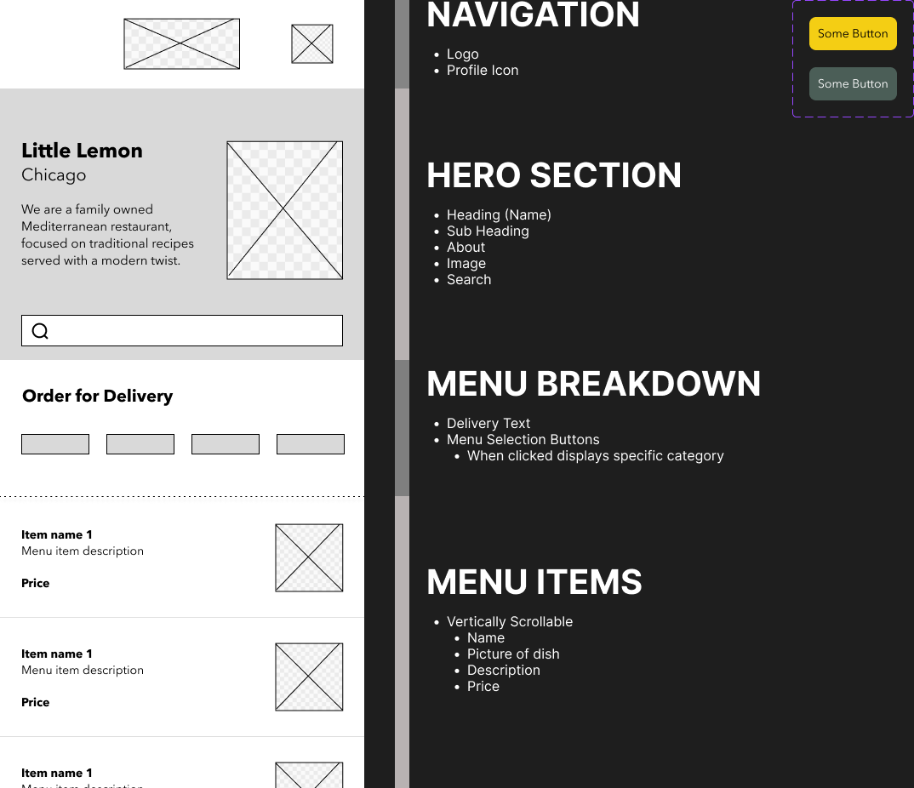
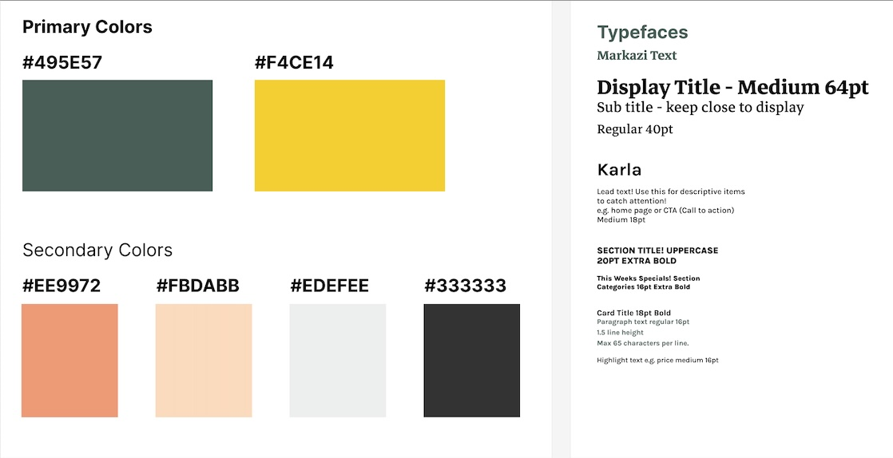

# Capstone Project for Coursera's Meta iOS Developer Professional Certificate

- Learner: Erick Patrick Alvarenga Rocha
- Submission date: 11.01.2025
- Figma file: [Check it here](prototype-table-booking-by-erick-rocha.fig)

Thank you for checking my project.

This is the repository for the Capstone project of the Coursera's Meta iOS Developer Professional Certificate. Differently from what the project rules state, they don't provide a basic project for us to adjust. What they provide is a set of steps we can follow to remind ourselves of how to do certain things.

Due to that, we (or at least I) had to build the project from scratch. I still believe I achieved what was required. All functionalities are in place. Maybe they're not following the best practices or use the most eloquent Swift/SwiftUI code. Specially when thinking that the course expects use to still use iOS 16 while we're already on iOS 18 and some APIs are deprecated.

# Wireframe

# Style Guide
